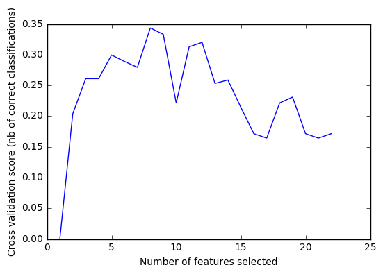

## Enron Submission Free-Response Questions

### Q1:
**Summarize for us the goal of this project and how machine learning is useful in trying to accomplish it. As part of your answer, give some background on the dataset and how it can be used to answer the project question. Were there any outliers in the data when you got it, and how did you handle those?  [relevant rubric items: “data exploration”, “outlier investigation”]**

The goal of this project is to predict who is person of interest (POI) in Enron scandal. Machine learning will be helpful by determining underlying patterns or relationships in financial data and email information. And we could optimaize and apply the algorithm to make predictions.

In our data set, there were 146 data points (person) and 20 features.

* 14 out of them were financial features, 5 were email features and 1 was the target label of POI.
* Among 146 data points there were 18 POIs which have already been identified.

There were many missing values.
```
Top 5 records by missing values:
LOCKHART EUGENE E                20
GRAMM WENDY L                    18
WROBEL BRUCE                     18
WHALEY DAVID A                   18
THE TRAVEL AGENCY IN THE PARK    18
```
`LOCKHART EUGENE E` contained no information except a label of POI, and `THE TRAVEL AGENCY IN THE PARK` did not represent a person. So I removed the 2 data points.

And there were a few outliers.
```
Top 5 records by outliers:
FREVERT MARK A             14
LAY KENNETH L              14
WHALLEY LAWRENCE G         13
SKILLING JEFFREY K         13
TOTAL                      12
```
Based on the facts of the case, this made sense for some of the finance data points and key individuals within Enron. Therefore, the records for actual people will not be removed. However, the `TOTAL` record is a spreadsheet calculation quirk from the finance data. So I removed `TOTAL` from the data set.

There were also data errors.

We expected that the sum of all payment features should be equal to `total_payments` and the sum of all stock features should be equal to `total_stock_value`. But there are two outliers.
* By comparing the sum of all payment features with 'total_payments'
```
BELFER ROBERT
BHATNAGAR SANJAY
```
* By comparing the sum of all stock features with 'total_stock_value'
```
BELFER ROBERT
BHATNAGAR SANJAY
```

I fixed it by shifting `BELFER ROBERT` values 1 column to the left, and `BHATNAGAR SANJAY` 1 column to the right. 

### Q2
**What features did you end up using in your POI identifier, and what selection process did you use to pick them? Did you have to do any scaling? Why or why not? As part of the assignment, you should attempt to engineer your own feature that does not come ready-made in the dataset -- explain what feature you tried to make, and the rationale behind it. (You do not necessarily have to use it in the final analysis, only engineer and test it.) In your feature selection step, if you used an algorithm like a decision tree, please also give the feature importances of the features that you use, and if you used an automated feature selection function like SelectKBest, please report the feature scores and reasons for your choice of parameter values.  [relevant rubric items: “create new features”, “intelligently select features”, “properly scale features”]**

New features:

I created 3 new features.
```
1. financial_total
2. fraction_from_poi
3. fraction_to_poi
```
`financial_total` was the features as a total of financial features (`total_payments` + `total_stock_value`). `fraction_from_poi` was to check the fraction of emails, received from POI, to all received emails. `fraction_to_poi` was the fraction of emails, sent to POI, to all sent emails.

Feature importances with forests of trees:
```
['fraction_to_poi', 0.34628571428571447]
['shared_receipt_with_poi', 0.22013095238095232]
['expenses', 0.16820105820105813]
['other', 0.15642989417989422]
['fraction_from_poi', 0.06128571428571427]
['deferral_payments', 0.047666666666666663]
```
According to DecisionTree, `fraction_to_poi` I created got the highest features importance for the model.

Feature scores with k best:
```
4 best features:
[('fraction_to_poi', 25.578788236346952),
 ('total_stock_value', 22.510549090242055),
 ('exercised_stock_options', 22.348975407306217),
 ('bonus', 20.792252047181535)]
```
`fraction_to_poi` got the highest features score.

RFECV: leverage the power of recursive feature selection to automate the selection process and find a good indication of the number of relevant features.

```
Selected features:
['expenses', 'exercised_stock_options', 'restricted_stock', 'total_stock_value', 'to_messages', 'from_messages', 'from_this_person_to_poi', 'from_poi_to_this_person']
```
RFECV result was so different with feature importances and feature scores. So I sorted data with RFECV in data_2, so that I could test the algorithms separately.

### Q3
**What algorithm did you end up using? What other one(s) did you try? How did model performance differ between algorithms?  [relevant rubric item: “pick an algorithm”]**

I've played with 5 machine learning algorithms:
* Naive Bayes
* Decision Tree
* Ada Boost
* Random Forest
* K-means

I made a pipe with 3 steps for each test:
* standardized features with `StandardScaler`;
* applied `PCA` to decrease the dimensionality of the data.
* applied the test algorithm

Results:
```
                          without RFECV                   with RFECV
              Precision  Recall      F1    Precision  Recall      F1
  Naive Bayes   0.26133 0.29400 0.27671      0.30298 0.25450 0.27663
Decision Tree   0.33170 0.33900 0.33531      0.30340 0.33450 0.31819
    Ada Boost   0.32789 0.33150 0.32969      0.30762 0.34300 0.32435
Random Forest   0.42715 0.12900 0.19816      0.37955 0.13550 0.19971
      K-means   0.12222 0.09900 0.10939      0.13806 0.46450 0.21285
```

I found out that RFECV is more efficient on naive bayes and k-means, but not on decision tree, adaboost or random forest.

Random forest got the highest precision, but was so weak on recall. I ended up using Decision Tree Classifier. Decision tree showed the best result and was significantly faster than RandomForest so I could easily tune it.

### Q4
**What does it mean to tune the parameters of an algorithm, and what can happen if you don’t do this well?  How did you tune the parameters of your particular algorithm? What parameters did you tune? (Some algorithms do not have parameters that you need to tune -- if this is the case for the one you picked, identify and briefly explain how you would have done it for the model that was not your final choice or a different model that does utilize parameter tuning, e.g. a decision tree classifier).  [relevant rubric items: “discuss parameter tuning”, “tune the algorithm”]**

Bias-variance tradeoff is a dilema in machine learning. Algorithms with high bias has no capacity to learn, while algorithms with high variance react poorly in cases we didn't met before. The meaning of tuning the parameters is to achieve the golden balance. If we cannot do this well, there is not chance to get the result we want.

For my final choice of algorithms, 'Decision Tree', I used `GridSearchCV` library to do this job automatically. The 3 outcome parameters are shown below:
* `criterion = 'gini'`
* `min_samples_split = 2`
* `min_samples_leaf = 3`

### Q5
**What is validation, and what’s a classic mistake you can make if you do it wrong? How did you validate your analysis?  [relevant rubric items: “discuss validation”, “validation strategy”]**

The validation is a process of model performance evaluation. The classic mistake we can make is to use small data set for the model training or validate model on the same data set as train it.

In this project, I used provided testing script which performs SSSCV (stratified shuffle split cross validation) approach with `StratifiedShuffleSplit` library.

Our dataset is small and skewed towards non-POI, the chance of randomly splitting skewed and non representative validation sub-sets could be high, therefore we need to use stratification (preservation of the percentage of samples for each class) to achieve robustness in a dataset with the aforementioned limitations. Otherwise, we would not be able to assess, in the validation phase, the real potential of our algorithm in terms of performance metrics.

I used F1 score as key measure of algorithms' accuracy in this project. It considers both precision and recall of the evaluation.

Precision can be interpreted as the likelihood that a person identified as a POI is actually a true POI. Recall is the likelihood that true POI is identified. And F1 score can be interpreted as a weighted average of the precision and recall.

### Q6
**Give at least 2 evaluation metrics and your average performance for each of them.  Explain an interpretation of your metrics that says something human-understandable about your algorithm’s performance. [relevant rubric item: “usage of evaluation metrics”]
**

There are many different ways to measure the performance of a machine learning algorithm. In our project, the three metrics we used are `precision`, `recall` and `F1`.

* `Precision` is the ratio `tp / (tp + fp)` where `tp` is the number of true positives and `fp` the number of false positives.
* `Recall` is the ratio `tp / (tp + fn)` where `tp` is the number of true positives and `fn` the number of false negatives.
* `F1` score is `F1 = 2 * (precision * recall) / (precision + recall)`, it can be interpreted as a weighted average of the `precision` and `recall`.

From testing script, we came out the following evaluation metrics:
```
           before tuning after tuning 
Precision:       0.33170      0.68002
   Recall:       0.33900      0.60250
       F1:       0.33531      0.63892
```

The precision score of 0.68 means, 68% person identified as a POI is actually a true POI. And the recall score of 0.60 means, 60% true POI is identified.
