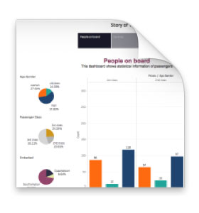
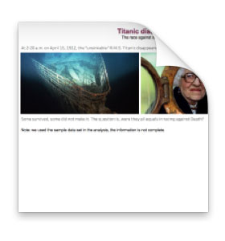

# Titanic Tableau Story

## Summary

The data set of Titanic is a simple one, but the whole story behind it is not that simple. With different point of views there are always something we could find out. My story is that Titanic didn't sink equally for everyone. Regardless of the truth behind "women and children first", wealth and social status played an important role on surviving the disaster.

## Tableau Public Workbooks

### First version

[Clicke Here](https://public.tableau.com/profile/wen.fan#!/vizhome/Titanic_Story_v1/Story)

### Final version

[Click Here](https://public.tableau.com/profile/wen.fan#!/vizhome/Titanic_Story_final/Story)

## Design

My principle is to make it simple and make it easy for readers to get the whole story.

### Initial design decisions

#### Hierarchy & chart type

I put the story into 3 parts. 
1. Distribution of passengers: I used a bar chart to visualize the passenger distribution on `Pclass` and `Age-Gender` category. I think this is the most intuitive way, and is most familiar to the reader. With 3 pie charts, I wanted to emphasize the proportion of these passenger groups.
2. Survival facts of passengers: Again I used a bar chart to visualize the overall status of survived and non-survived passengers. And I put 2 groups of donut charts together to compare the survival rate of women, children and men, and the survival rate of 1st class, 2nd class and 3rd class passenger.
3. Families on board: I filtered out the families with more than 5 members on board and plotted the family survival rate with bar charts. Yes I think bar chart is easy to understand in this situation. I also used table to list all family members with more details like `Gender`, `Age`, `Fare` and `Survived?`. Tables are suitable for details.

#### Visual encodings

Most features I visualized in the story are categorical, then color, texture and shape are all appropriate encodings. But I chose color only, because I think it's stronger than other two.

### Final version

In the final version, I made it 5 parts:
1. Opening: gives a short introduction of the disaster and throws the question we are about to figure out.
2. Distribution of passengers: shows how many women, children or men were on board, and the percentages of the 1st class 2nd class and 3rd class passengers.
3. Survival facts of passengers: shows survival rate of different age-gender groups (women, children and men) and of different passenger classes (1st class, 2nd class and 3rd class)
4. Families on board: shows the survival facts of big families on board (more than 5 members) and how it was different in the 3rd class.
5. Ending: some words in the end.

### Calculated fields

1. `Age-Gender`: a category feature with values of women, children and men.
2. `Survived?`: a feature with binary values of yes and no.
3. `Survival Rate`: % of passengers survived the disaster.

## Feedback

I shared the project with two of my friends and got some feedbacks as following:

* It does not feel like a story. There is no beginning nor ending.
* It will be easier to understand if adding some instructions in writing.
* The `Embarked` with so many colors may distract readers' attention from the main story line. (1st story point in v1)
* Readers may confuse why family 'Sage_11' with `Fsize` of 11, has only 7 family members in records. (3rd story point in v1).

### Design actions taken based on feedback

* I added 2 more story points, one for the opening and one for the ending.
* I added text description for every story point.
* I removed the `Embarked` pie chart from the story point of distribution.
* I added a note in the 1st story point to declare that what we use are sample data, which is not complete.

## Resources

* [Ticket_Fare analysis](https://www.kaggle.com/arjoonn/ticket-fare-analysis)
* [Kaggle Titanic Competition Part II – Missing Values](http://www.ultravioletanalytics.com/2014/11/03/kaggle-titanic-competition-part-ii-missing-values/)
* [Tatbleau 201: How to Make Donut Charts](http://www.evolytics.com/blog/tableau-201-how-to-make-donut-charts/)
* [Titanic: Passengers and Possessions Pictures](http://www.history.com/topics/titanic/pictures/titanic-passengers-and-possessions/steaming-to-sea-for-trial-run-1912)
* [Titanic 100: How Peterborough's Sage family lost their lives](http://www.bbc.com/news/uk-england-cambridgeshire-17596264)
* [The Six: The Untold Story of RMS Titanic's Chinese Passengers](https://www.whoarethesix.com/)
